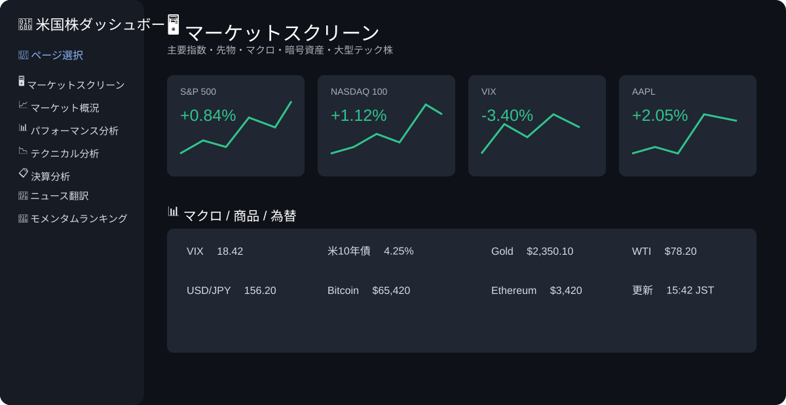
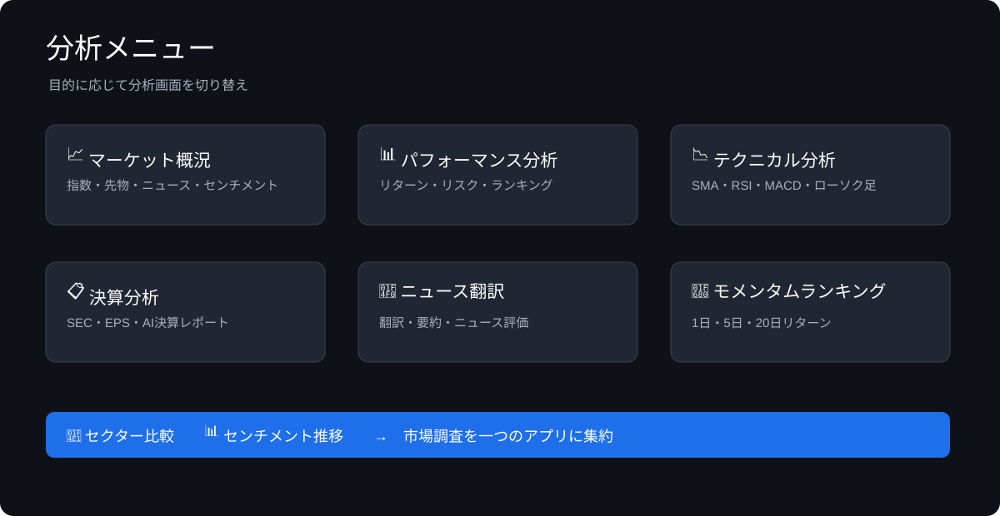

# 🇺🇸 usstock-metrics

[](https://www.python.org/)
[](https://streamlit.io/)
[](#ライセンス)

**usstock-metrics** は、NASDAQ-100を中心とした米国株の市場情報・テクニカル指標・決算情報を一つの画面で確認できる、Streamlitベースの分析ダッシュボードです。

市場データ、SEC EDGAR、ニュース、複数のAIプロバイダーを組み合わせ、日々の市場モニタリングと調査業務を効率化します。

> **免責事項**: 本システムは情報提供・分析補助を目的としたもので、投資助言ではありません。データの正確性・完全性・適時性および投資結果を保証するものではありません。

## 📸 画面イメージ

### マーケットスクリーン

主要指数、先物、マクロ指標、暗号資産、大型テック株を一覧で確認できます。



### 分析メニュー

サイドバーから市場概況、パフォーマンス、テクニカル分析、決算、ニュース、モメンタム、セクター比較、センチメント推移を切り替えます。



> 画像はリポジトリに含まれる画面イメージです。実際の表示値・チャートは取得時点のデータにより変わります。

## 🎯 対象業務

- 米国市場の朝会・日次モニタリング
- NASDAQ-100銘柄のスクリーニング
- リターン・リスク指標による比較調査
- テクニカル指標を用いたチャート確認
- 決算・SEC提出書類・ニュースの調査
- AIによるニュース翻訳・要約・企業解説

## ✨ 主な機能

| 画面 | 概要 |
| --- | --- |
| 🖥️ マーケットスクリーン | 指数、先物、マクロ、為替、暗号資産、大型テック株の価格とチャートを一覧表示 |
| 📈 マーケット概況 | S&P 500 / NASDAQ-100のセンチメント、主要指標、ニュースを確認 |
| 📊 パフォーマンス分析 | QQQを基準に、リターン、リスク、シャープレシオ、ベータ、アルファを比較 |
| 📉 テクニカル分析 | ローソク足、SMA、出来高、RSI、MACDを表示 |
| 📋 決算分析 | SEC XBRL、10-K / 10-Q、EPS、PER、PBR、AIレポートを確認 |
| 📰 ニュース翻訳 | Yahoo Financeニュースの翻訳、要約、センチメント分析 |
| 🚀 モメンタムランキング | 当日・5日・20日リターンの加重スコアでランキング |
| 📡 セクター比較 | 光通信・半導体バスケット、ETF、NASDAQ-100を比較 |
| 📊 センチメント推移 | RSI、MACD、VIX、モメンタム、SMA50から推移を可視化 |

### データ取得のフォールバック

パフォーマンス分析では、次の順にデータソースを切り替えます。

`Tiingo → Stooq → Yahoo Finance`

AI機能は次の順にフォールバックします。

`Gemini → Groq → OpenRouter`

## 🧮 分析指標

- 年間リターン / 年間リスク
- シャープレシオ
- ベータ / アルファ
- レジデュアルリスク
- SMA 20 / 50 / 200
- RSI（14）
- MACD（12, 26, 9）
- 1日 / 5日 / 20日モメンタム
- VIXおよび先物・CFDを用いた市場センチメント

## 🛠️ 技術構成

- Python 3.10+
- Streamlit
- pandas / NumPy
- Plotly / Matplotlib
- Yahoo Finance / Tiingo / Stooq
- SEC EDGAR / SEC XBRL
- RSSニュースフィード
- Google Gemini / Groq / OpenRouter

## 🚀 セットアップ

### 前提条件

- Python 3.10以上
- インターネット接続
- AI機能を使う場合は、利用するAIプロバイダーのAPIキー

### インストールと起動

```bash
git clone https://github.com/w-index-m/usstock-metrics.git
cd usstock-metrics

python -m venv .venv

# macOS / Linux
source .venv/bin/activate

# Windows PowerShell
.venv\\Scripts\\Activate.ps1

pip install -r requirements.txt
pip install xlsxwriter
streamlit run app.py
```

### Secretsの設定

ローカルでは `.streamlit/secrets.toml` を作成します。未使用の項目は空欄で構いません。

```toml
TIINGO_API_KEY = ""
GEMINI_API_KEY = ""
GROQ_API_KEY = ""
OPENROUTER_API_KEY = ""

SMTP_HOST = ""
SMTP_PORT = 587
SMTP_USER = ""
SMTP_PASS = ""
NOTIFY_EMAIL = ""
```

## 🔐 セキュリティ運用

- APIキー、SMTPパスワード、個人情報をソースコードやREADMEに記載しないでください。
- `.streamlit/secrets.toml` はGit管理対象外にしてください。
- 公開リポジトリやGit履歴にキーを登録した場合は、直ちに無効化・再発行してください。
- 外部APIの利用規約、レート制限、提供データのライセンスを遵守してください。

### `.gitignore` の例

```gitignore
.streamlit/secrets.toml
Secrets
.env
__pycache__/
.venv/
```

## 📁 構成

```text
usstock-metrics/
├── app.py                         # Streamlitアプリ本体
├── requirements.txt               # Python依存パッケージ
├── font/                          # 日本語表示用フォント
├── docs/screenshots/              # README用の画面イメージ
└── README.md
```

## 📡 外部サービスと制約

Yahoo Finance、Tiingo、Stooq、SEC EDGAR、ニュースRSS、Wikipedia、AI APIに依存します。サービス障害、仕様変更、レート制限、銘柄コード変更などにより、データが取得できない場合があります。

## 📄 ライセンス

ライセンスは現在設定されていません。社内利用、再配布、商用利用の際は、リポジトリ管理者へ確認してください。
